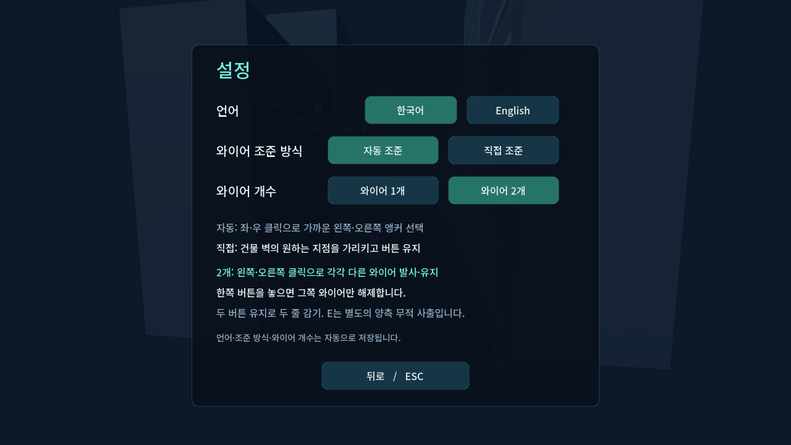

# Wire Rush

건물에 와이어를 걸고 스윙하며, 착지 후 스케이트로 속도를 유지하거나 양측 사출로 돌진하는 3D 무한 진행 게임 프로토타입.

**v0.4.0 · Godot 4.7.1 · Windows x64 · 한국어/English · 오프라인 싱글플레이**


## 실행

로컬 `builds/WireRush-0.4.0-Windows.zip`을 풀고 `WireRush.exe`를 실행합니다. 엔진 설치 없이 실행할 수 있습니다. 소스에서는 Godot 4.7.1로 `project.godot`를 가져온 다음 F5로 실행합니다.

**0.4.0 조작 개선:** 카메라를 기존 먼 시점(뒤 12m·위 4.5m)과 추적 설정으로 복원했습니다. **설정 → 와이어 개수 → 와이어 2개**에서 좌·우 클릭으로 두 와이어를 독립적으로 발사·유지·해제할 수 있습니다. 자동·직접 조준 모두 지원합니다.

착지 정지, 스케이트의 속도 유지 2/3.5/5초, E 양측 무적 사출, 복귀 후 2초 보호도 지원합니다.

기본 앵커 높이는 16~18m입니다. 두 조준 모드 모두 **마우스 버튼을 유지하면 자동으로 와이어를 감습니다.** Shift는 필요 없습니다.

메인 메뉴 **설정(Settings)** 또는 **Esc → 설정**에서 **한국어/English**와 **자동 조준/직접 조준**을 선택합니다. 언어는 즉시 적용되고 선택한 설정은 다음 실행에도 유지됩니다. 최초 기본값은 한국어·자동 조준입니다.

**직접 조준**에서는 건물 벽의 원하는 지점을 마우스로 가리키고 좌·우 버튼 중 하나를 유지합니다. **1개 모드**에서는 반대 버튼으로 연결 위치를 바꿉니다. **2개 모드**에서는 반대 버튼으로 별도의 와이어를 추가하며 해당 버튼을 놓으면 그 줄만 해제합니다. 선택한 지점은 고정되며, 유효하지 않은 지점을 눌러도 기존 줄이 끊기지 않습니다.



- **Enter / Start Run**: 거리 기록 도전. 레벨업으로 장비 획득.
- **P / Practice**: 스케이트와 양측 사출을 즉시 사용. 장애물 없는 연습 구간과 자동 복구. 최고 기록에 반영되지 않음.
- **마우스 좌/우 버튼 유지**: 자동 모드에서는 왼쪽/오른쪽 앵커, 직접 모드에서는 커서가 가리킨 건물 벽에 연결. 활성 버튼을 놓으면 관성을 유지하며 해제.
- **자동 줄 감기**: 갈고리가 연결된 뒤 활성 마우스 버튼을 유지하면 줄이 감깁니다. 버튼을 놓으면 줄을 해제하고 관성으로 비행합니다.
- **Space**: 지상/슬라이드에서 점프. **A/D**: 좌우 보정. **E**: 양측 사출.
- **Esc**: 일시정지. **R**: 재시작. **1/2/3**: 레벨업 선택.

처음에는 **Practice → 마우스 버튼 유지 → 앵커를 지나며 반대편으로 전환**을 연습하세요. 상세 착지 조건은 [플레이 안내](docs/PLAY_GUIDE.md)를 참고하세요.

## 구현 범위

자동·직접 와이어 조준, 한국어·영어 설정, 와이어 1개/2개 스윙·갈고리 비행·자동 감기·독립 해제, 안전 착지와 시간제 스케이트, 양측 무적 사출/방어구/고층 앵커, 복귀 보호, 3택1 성장, 6개 도로 패턴, 거리 기록, 청크 정리와 원점 이동, 메뉴·HUD·합성 효과음을 포함합니다. 모든 모델은 기본 도형으로 직접 구성했습니다.

기획 원문 전체의 완성판이 아닙니다. 초반 연결성과 핵심 동작을 실행하며 검증하는 첫 버전입니다. 장애물 조합 전체의 공정성, 5회 연속 스윙-슬라이드 루프, 난이도 곡선과 사용자 체감은 후속 검증 대상입니다.

## 개발과 검증

```powershell
powershell -NoProfile -ExecutionPolicy Bypass -File .\tools\Validate.ps1 -Godot 'C:\path\Godot_v4.7.1-stable_win64_console.exe'
powershell -NoProfile -ExecutionPolicy Bypass -File .\tools\Build-Windows.ps1 -Godot 'C:\path\Godot_v4.7.1-stable_win64_console.exe' -Templates 'C:\path\4.7.1.stable'
```

템플릿은 실행 엔진과 일치하는 공식 Windows export templates를 사용합니다. 엔진·템플릿·빌드 파일은 Git에 넣지 않습니다. `--test`는 기록 파일을 쓰지 않는 검증 모드입니다.

- [진행 현황과 검증 범위](docs/PROGRESS_OVERVIEW.md)
- [설계 및 원문 대비 결정](docs/IMPLEMENTATION.md)
- [원문 자료](docs/ORIGINAL_BRIEF.md)
- [엔진 라이선스 고지](docs/THIRD_PARTY_NOTICES.md)

새 저장소: https://github.com/Autopopcornshooter/wire-rush

로컬 개발 폴더는 `D:\GameProject\WireSwing`입니다. 기존 HellDelivery와 별도 Git 저장소입니다.
