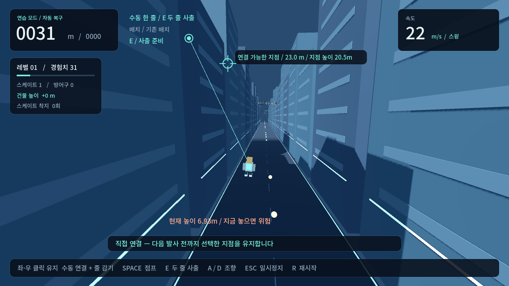
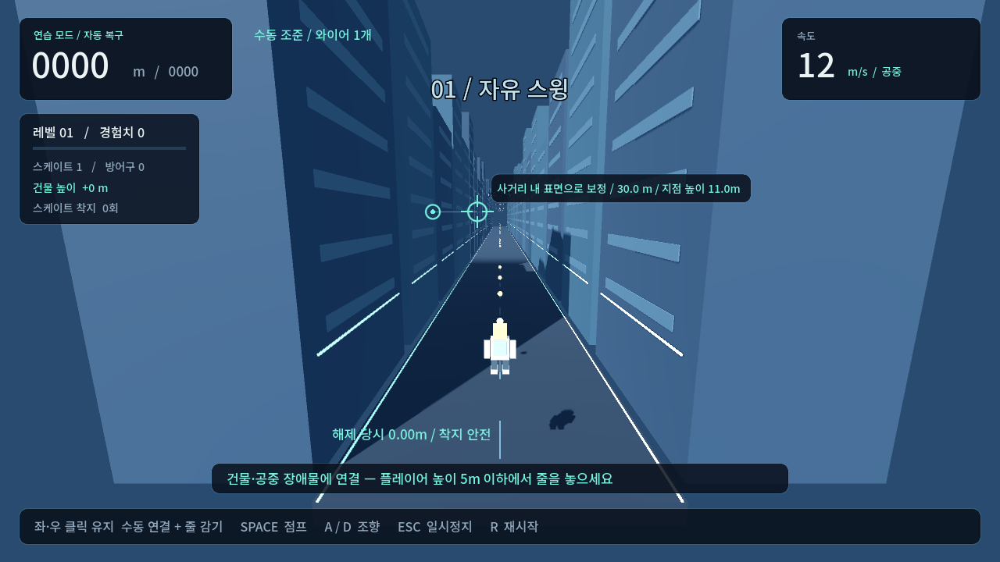

# Wire Rush

건물과 공중 장애물에 한 줄 와이어를 직접 걸어 스윙하고, 플레이어가 낮게 내려왔을 때 줄을 놓고 착지하는 3D 게임 프로토타입.

**v0.6.0 · Godot 4.7.1 · Windows x64 · 한국어/English · 오프라인 싱글플레이**



## 실행과 조작

로컬 `builds/WireRush-0.6.0-Windows.zip`을 풀고 `WireRush.exe`를 실행합니다. 엔진 설치 없이 실행할 수 있습니다.

- **좌·우 마우스 버튼 유지:** 커서가 가리킨 건물 또는 공중 장애물에 수동 연결하고 자동으로 줄을 감습니다.
- **반대 버튼:** 현재 한 줄을 새 지점으로 옮깁니다. 활성 버튼을 놓으면 관성을 유지하며 해제합니다.
- **먼 곳 조준:** 최대 사거리 부근의 실제 건물·공중 장애물 표면으로 보정합니다. 청록색 보정 표식이 연결될 위치입니다.
- **E:** 전방 양쪽 건물에 두 줄 동시 사출. 두 앵커의 중간 방향으로 돌진하며 **무적 없음**, 재사용 10초. 시작부터 사용 가능합니다.
- **Space:** 지상·스케이트에서 점프. **A/D:** 조향.
- **Esc:** 일시정지·설정. **R:** 재시작. **1/2/3:** 레벨업 선택.
- 설정에서는 한국어/English를 즉시 바꾸고 저장할 수 있습니다.

일반 스윙은 수동 한 줄이며 E 두 줄 사출과 속도 강화 퍽을 복구했습니다. 자동 앵커 네트워크와 마우스 두 줄 독립 모드는 사용하지 않습니다.

설정의 배치 비교에서 **기존 배치 / A: 건물 간격 / B: 수직 차단벽**을 선택한 뒤 새로 시작하세요. A/B는 기존 최고 기록을 갱신하지 않습니다. [51회 자동 주행 비교 결과](docs/ROUTE_COMPARISON.md)에 시험 조건과 한계를 기록했습니다.



## 착지·장비·장애물

**연결된 와이어를 놓는 순간의 플레이어 높이가 5m 이하이면 도로에 안전하게 착지합니다.** 5m 초과에서 놓으면 도로 충돌 시 게임오버이며 방어구·복귀 보호·연습 복구로 막을 수 없습니다. 앵커 위치와 무관하게, 18m 앵커에서 플레이어 높이 4m에 놓으면 생존하고 4m 앵커에서 플레이어 높이 8m에 놓으면 위험합니다. 일반 점프는 예외지만 새 와이어가 실제로 연결되면 예외가 해제됩니다. 벽의 청록색 선과 HUD로 플레이어 높이를 확인할 수 있습니다.

스케이트는 새로운 와이어 연결 후 플레이어 높이 5m 이하에서 해제하고 착지할 때 시작합니다. 타이머 대신 **마찰 계수 0.35 / 0.22 / 0.12**로 자연스럽게 감속합니다. 점프만 하고 재착지하면 스케이트가 갱신되지 않으며, 다시 연결하고 플레이어 높이 5m 이하에서 해제해야 다시 슬라이드할 수 있습니다.

높이 업그레이드는 현재·미래 건물을 **+10 / +20 / +30m** 높이고 공중 장애물도 **+8 / +16 / +24m** 올립니다. 공중 장애물은 64m마다 4개, 각각 약 **2.6 × 2.2 × 1.4m**입니다. 연결된 장애물 뒤로 스윙해도 줄이 유지되며, 다른 장애물의 줄 가림과 몸 충돌은 위험합니다. 도전 첫 128m와 연습 모드는 장애물 없이 시작합니다.

카메라는 기존 먼 시점(뒤 12m·위 4.5m)을 유지합니다. 상세 규칙은 [플레이 안내](docs/PLAY_GUIDE.md)에 있습니다.

## 개발과 검증

```powershell
powershell -NoProfile -ExecutionPolicy Bypass -File .\tools\Validate.ps1 -Godot 'C:\path\Godot_v4.7.1-stable_win64_console.exe'
powershell -NoProfile -ExecutionPolicy Bypass -File .\tools\Build-Windows.ps1 -Godot 'C:\path\Godot_v4.7.1-stable_win64_console.exe' -Templates 'C:\path\4.7.1.stable'
```

템플릿은 실행 엔진과 일치하는 공식 Windows export templates를 사용합니다. 엔진·템플릿·빌드 파일은 Git에 넣지 않습니다. `--test`는 기록 파일을 쓰지 않는 검증 모드입니다.

- [배치 비교 결과](docs/ROUTE_COMPARISON.md)
- [진행 현황과 검증 범위](docs/PROGRESS_OVERVIEW.md)
- [설계 및 원문 대비 결정](docs/IMPLEMENTATION.md)
- [원문 자료](docs/ORIGINAL_BRIEF.md)
- [엔진 라이선스 고지](docs/THIRD_PARTY_NOTICES.md)

새 저장소: https://github.com/Autopopcornshooter/wire-rush

로컬 개발 폴더는 `D:\GameProject\WireSwing`입니다. 기존 HellDelivery와 별도 Git 저장소입니다.
