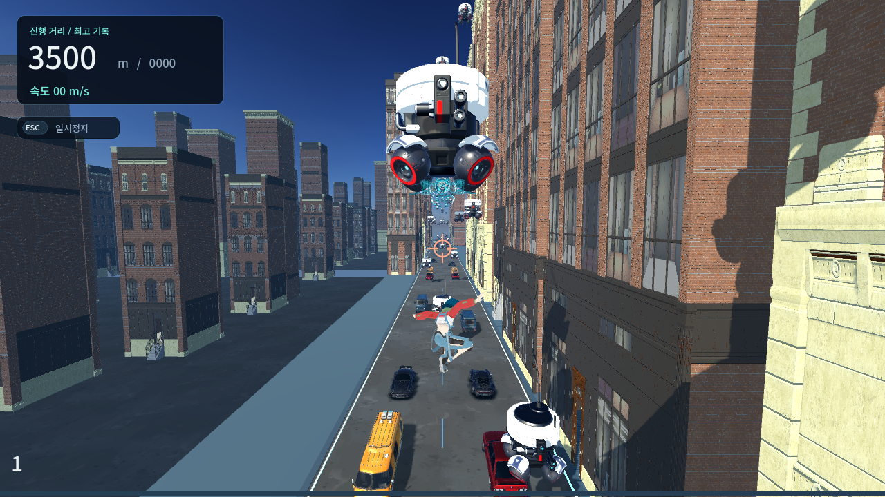
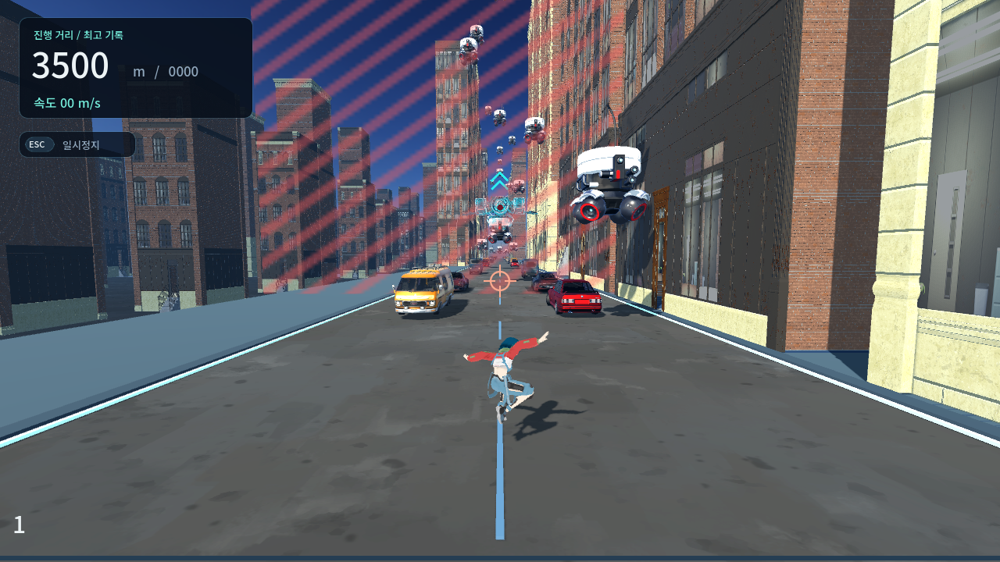
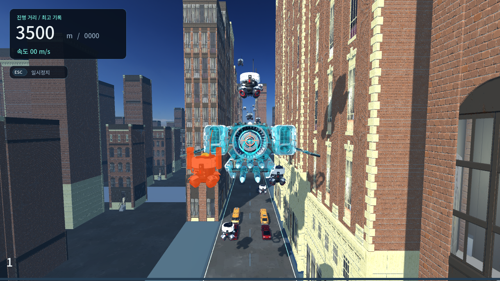

# Boss QA Pass 2 — Targeted visual fixes

2026-09-22. 요청된 세 항목 수정 및 런타임 재검증 완료.
HEAD `44dd410f0e6ca2eede238609d20e84af9bb562e1`, version `0.13.0`; 기존 작업 트리 변경 유지.

[INPUT ISSUES]

## #1 가까운 일반 드론이 보스와 발사 원점을 가리는 문제

- Reproduction: Pass 1의 3500m, 높이 12m, 중립 카메라에서 전경 일반 드론이 원거리 보스와 센서를 가린다. 같은 위치를 Pass 2에서 재현했다.
- Root cause: 원근에 따른 화면상 크기 차이와 깊이 가림. 모델 자체 크기보다 시선 중첩 문제다.
- Fix: 보스 모델에 공유 청록 윤곽 셰이더를 추가하고, 센서 링·충전·빔을 깊이 가림 없이 표시한다. 일반 드론의 위치·충돌·와이어 표면은 그대로다. 보스 본체 재질 위에 반투명 윤곽만 추가한다.
- Test: 센서·충전 깊이 설정, 빔 끝점과 이동하는 눈 좌표, 원점 이동 검사 통과.
- Runtime result: 동일한 전경 드론 뒤에서도 보스 윤곽과 센서가 보인다. 지상/12m/40m 시점 확인. 가까운 드론이 물리적으로 사라지는 방식이 아니므로 위험물도 계속 보인다.

## #2 B 하단 공격 시 화면 밖 상단 회피 경로의 가독성

- Reproduction: 높이 0.85m와 12m에서 하단 위험 영역은 보이지만 상단 안전 경계가 화면 밖에 있다.
- Root cause: 실제 위험 부피만으로는 화면 밖 안전 방향을 전달하기 어렵다.
- Fix: B 경고/활성 중 보스 위에 월드 공간 청록 이중 화살표를 표시한다. 하단 공격은 위쪽, 상단 공격은 아래쪽. 회복·퇴각 때 숨긴다. 새 HUD나 충돌은 없다.
- Test: 상/하 방향 반전, 경고 중 충돌 OFF, 회복/퇴각 정리 통과.
- Runtime result: 0.85/12/40m에서 상단·하단 공격을 각각 확인했다. 화면 밖 안전 영역으로 향하는 방향이 화면 안에 표시된다.

## #3 C 발사 플래시와 실제 로봇 생성 위치의 시각적 어긋남

- Reproduction: Pass 1 근접 캡처에서 중앙 포트 플래시와 좌우 로봇이 떨어져 생성된다.
- Root cause: 플래시는 bob/tilt/2.2배 스케일이 적용된 모델 포트, 로봇은 boss root 기준의 별도 월드 좌표를 사용했다.
- Fix: 로봇과 플래시가 동일한 `spawn_pos`를 사용한다. 기존 좌/중/우 출구 위치와 속도·조준 수식은 유지한다. 짧은 플래시는 발사 시점의 위치에 남고 로봇만 전진한다.
- 추가로 원점 이동한 `barrage_root` 아래에서 새 로봇에 월드 좌표를 로컬 좌표로 넣던 오류를 수정했다. `robot.global_position`으로 설정하여 원점 이동량이 중복 가산되지 않는다.
- Test: hover 중 세 출구 정렬, 기존/신규 로봇의 원점 이동 후 위치, 플래시 정렬 통과.
- Runtime result: 두 C 사이클의 1/2/3기 근접 캡처에서 생성 위치 정렬 확인. 연속 주행에서도 원점 이동 이후 발사·이동·정리 정상.

[BOSS SCALE]

- 모델 스케일 2.2 유지, 유효 폭 약 13.0m. 크기 문제가 아니므로 보스 위치/스케일을 바꾸지 않았다.

[EYE LASER]

- `ModelRoot` 아래 emitter local `(0, -0.55, 1.3)` 유지. 2.2배 스케일과 VisualPivot hover/tilt를 상속한다.
- Pass 1의 충전 alpha 수정 유지. 센서 링·충전·빔은 전경 드론에 가려져도 읽을 수 있다.
- 기존 빨간 core/glow 색상·굵기·위험 영역 중심 표적 유지.

[A/B]

- A 좌/우, B 상/하 렌더러 확인. 경고 중 비충돌, 활성 2초, 시각/충돌 부피 일치 기존 검사 통과.
- A 경고 1.08초, B 경고 1.62초, 위험 영역 크기 및 거리 조건 그대로.

[C]

- 3기 순차 발사, 16m/s 직선 이동, 기존 수명/후방 정리 유지. 플래시 위치와 원점 이동 오류만 수정.

[ORIGIN SHIFT]

- 모델·눈·빔·위험 영역·로봇·발사/피격 flash 상대 위치 유지 확인.
- world-space GPU trail은 원점 이동 때 restart하여 이전 좌표의 입자가 긴 잔상으로 남지 않도록 했다. 짧은 궤적은 새 위치에서 다시 생성된다.
- 연속 주행 두 번 모두 4096m 원점 경계를 통과했다.

[CLEANUP]

- 짧은 flash와 tween을 추적하고 정상 만료 때 등록 해제한다. reset/escape 시 즉시 kill/free한다.
- 공격·퇴각 12회 반복 후 임시 자식 노드 누적 없음. 두 연속 주행 종료 시 로봇 0, 임시 FX 0.
- 런타임/회귀 로그에 SCRIPT ERROR, 셰이더 오류, ObjectDB 누수 경고 없음.

[PERFORMANCE]

- RTX 2070 SUPER / OpenGL Compatibility, 1280×720, 60fps 상한.
- 3500m B 활성 고정 장면에서 새 윤곽/센서 링/방향 표시 OFF/ON 비교. 각 60프레임 준비 후 120프레임 표본.

| 항목 | OFF | ON |
|---|---:|---:|
| 프레임 간격 중앙값 | 16.686ms | 16.652ms |
| 95백분위 | 17.599ms | 17.366ms |
| draw calls | 7,174 | 7,187 |
| primitives | 6,807,699 | 7,197,353 |

- 표본에서 유의한 프레임 저하를 관찰하지 못했다. 단일 고정 장면·상한 60fps의 짧은 측정이며 전체 장면/다른 GPU 성능 보장은 아니다. 동적 광원 추가 없음, 기존 로봇당 trail 입자 10개 유지.
- 윤곽은 모델의 추가 투명 렌더 패스이므로 비용이 0은 아니다. 공유 ShaderMaterial을 사용한다.

[REGRESSION]

- 수정 후 `tools/Validate.ps1` **930/930**, 기존 traversal 및 전체 gate 통과. 보스 **210/210**.
- `git diff --check` 통과.

[FULL RUN]

- 실제 OpenGL 렌더러와 키 입력 이벤트를 사용한 지상 이동·점프·측면 회피 자동 주행 **2회 완주**. 시작 위치만 3200m로 배치하고 이후 구조/텔레포트/무적/충돌 우회 없음.
- 60Hz 물리 tick, 30tick마다 렌더링하는 가속 검증이다. 고속 수동 와이어 주행 또는 프레임 성능 측정으로 세지 않는다.
- 봇은 C의 세 발사 이후 측면으로 이동하며, 차량 차선을 건너기 전에 지상에서 횡속도를 만든 다음 점프했다. 종료 뒤 중앙으로 복귀한다. 게임 물리나 공격 수치는 조정하지 않았다.

| 주행 | 종료 거리 | 물리 tick | Boss | 잔여 FX/로봇 | 원점 누적 |
|---|---:|---:|---|---|---:|
| 실제 제공 업그레이드 선택 | 4720.017m | 20,245 | CLEARED | 0 / 0 | 4096m |
| 무업그레이드 | 4720.023m | 21,695 | CLEARED | 0 / 0 | 4096m |

- A/B/C 반복, intro/escape, Boss Clear Signal 확인. 최대 청크 8, 샘플 최대 노드 10,788, 공중 지상 포즈 오류 0.
- 최종 성공 전 입력 봇 시도 6회는 3200~3339m에서 충돌로 실패했다. 첫 방식은 로봇을 향해 점프했고, 다음 방식은 횡속도가 충분하기 전에 점프하여 차량 차선에 착지했다. 두 번째 주행의 입력 이벤트 처리도 수정했다. 실패 로그는 `boss-high-full-runs-attempt1/2/3.log`로 보존했다.
- 이번 세 가지 수정의 기술적 미해결 항목 없음. City 전체 고속 와이어 검증은 별도 범위다.

[REMAINING HUMAN QA]

- 청록 윤곽/센서 표시의 강도와 깊이 가림을 통과하는 표현의 미감.
- 이중 화살표의 크기·색상, 빨간 빔과의 시각적 조화.
- 주황 발사 flash와 trail 강도.

재현 자료: 로컬 `validation/boss-high-validation.log`, `boss-high-rendered.log`, `boss-high-full-runs.json`, `boss-high-full-runs.log`, `boss-high-perf.json`, `boss-high-*.png`.
임시 실행 프로브는 정리했다. 변경은 소스 작업 트리에 있으며 이번 패스에서 EXE 갱신·커밋·푸시는 하지 않았다.
