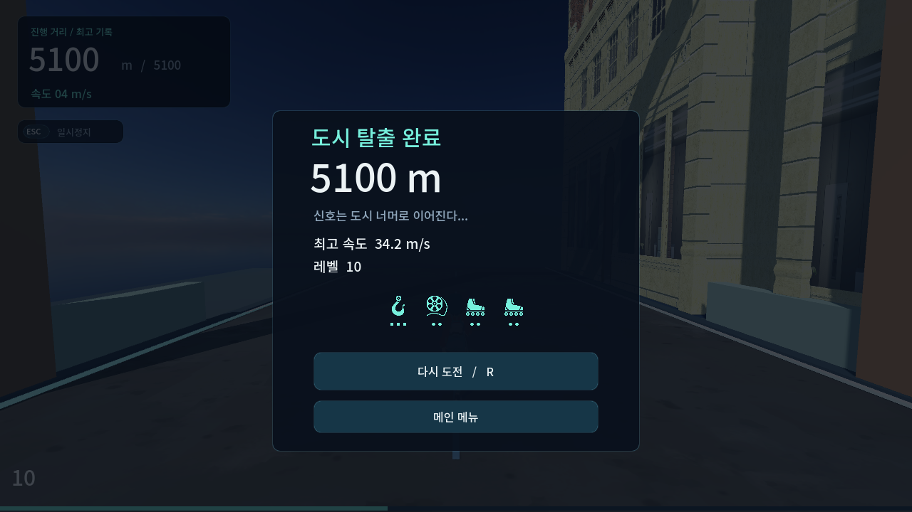
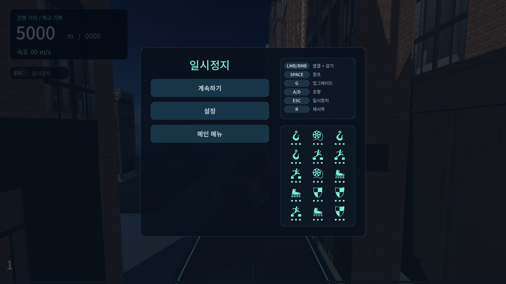
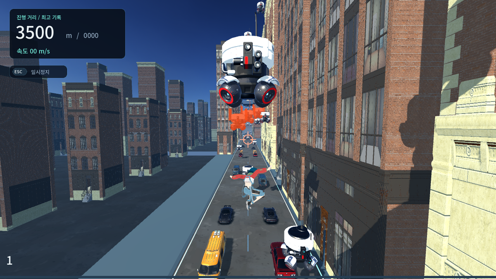
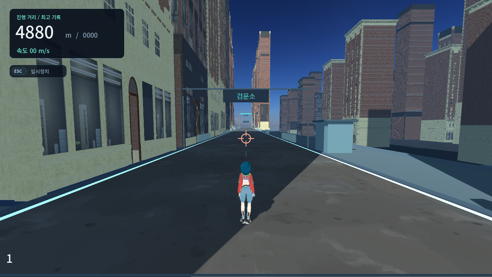

# Wire Rush 0.13.0 — City completion candidate

검증일: 2026-09-22. 코드·실행 결과 기준. 이번 상태는 **NOT COMPLETE**다. 종료 흐름과 아래 수정은 구현했지만, 고속 수동 와이어로 전체 챕터를 세 번 클리어한 것은 아니다. 자동 지상 주행의 성공을 그 검증으로 대체하지 않는다.

[HEAD]

- 시작 HEAD: `44dd410f0e6ca2eede238609d20e84af9bb562e1`, `main`, 시작 작업 트리 clean.
- 버전: 0.12.4 → 0.13.0. 변경은 작업 트리에 있으며 이 단계에서 commit/push하지 않았다.
- Windows 후보 빌드: `builds/WireRush-0.13.0-Windows/WireRush.exe`, 동명 ZIP.

[CITY FLOW]

| 거리 | 확인 및 변경 |
|---|---|
| 0–500m | 원래 27m 시작 높이와 초기 두 청크 높이 유지. 벽의 Safe Zone 띠가 과도하게 빛나지 않도록 정리. 시작 Signal 유지. |
| 500–1000m | 모델·높이 선택을 결정적 해시로 변주. 기존 편측 건물 교대, 도로 폭, 표면 충돌과 기본 와이어 사거리 유지. |
| 1000–2000m | 기존 높이·드론·차량 난이도 상승 유지. 새 건물 생성이 기존 벽 재질을 바꾸는 문제 수정. |
| 2000–3200m | Sky Gap 접근/진입 표지와 배경 개방, Traffic Surge 진입 표지, 이벤트 끝의 청록 표시. 신규 이벤트 없음. |
| 3200–4700m | 보스 발사 원점을 지상/공중 시점에서 보이도록 높이 추종. 발사 로봇 주황색 오버레이와 핀, 레이저 투명도, 경고·발사·등장·퇴각 효과음. |
| 4700–5100m | 빈 도로, 외곽 검문소·방호벽·출구 표지, 낮은 배경 밀도. 4700m 경계 프레임에서는 새 공격보다 퇴각을 먼저 처리. 5100m에 명시적인 결과 화면. |

[MAP / WORLD]

- 실제 건물 3종, 차량 5종, 드론, 플레이어, 애니메이션, HDRI를 그대로 사용했다.
- 건물 모델 선택의 `index * 3` 반복을 해시로 바꾸고 높이 선택도 분산했다. 폭 8m, 깊이 14m, 슬롯 간격 16m, 도로 14m는 유지했다. 시각 변주를 위해 연결 간격을 늘리지 않았다.
- 도로와 건물 사이 포장면을 연결하고 배경 지면을 -18m에서 -4m로 올렸다. 기존 기초 스커트와 낮은 대비의 배경 재질 유지.
- Sky Gap 접근과 Rest에서 가까운 배경 일부를 비워 실루엣에 변화가 생긴다. 화면 상단 HDRI와 원경 안개를 실제 캡처에서 확인했다.
- 0/250/500/750/1000/1500/2000/2500/3000/3200/3500/4000/4500/4700/5000m를 렌더러 위치 프로브로 캡처했다. 위치 이동 프로브이며 전체 자유 플레이로 세지 않는다.
- 출구 표시는 실제 5100m에 맞췄다. 이후 청크를 생성하지 않으며 다음 챕터 이벤트의 접근 표지도 표시하지 않는다. 월드 표지는 설정에서 언어를 바꾸면 함께 갱신된다.

[EVENTS]

- Sky Gap: 기존 드론 연결 경로와 차량 없는 구간 유지. 접근 표지, 배경 개방, 출구 색상 표시를 추가했다.
- Traffic Surge: 기존 간격·간헐적 차량 공백·양방향 흐름 유지. 표지는 월드 공간에만 존재한다.
- 추가 이벤트 없음. HUD 이벤트 팝업 없음.
- 기본 사거리 연결 간격 회귀 검사 통과 범위의 최악 간격은 23.2m로 26m 가드 이내다. 이 기하학 검사는 모든 고속 상황에서 대응이 쉽다는 뜻은 아니다.

[BOSS]

- A: 좌/우 교대, 원래 위험 부피, 3회 점멸, 활성 2초 유지.
- B: 위/아래 절반 교대, 전체 폭, 원래 깊이, 활성 2초 유지. 활성 재질은 A/B 공통으로 반투명하게 정리했다.
- C: 기존 드론에 주황색 오버레이와 핀을 붙여 정지 드론과 구분한다. 보스 선체 상대 발사점, 3회 순차 발사, 16m/s 직선 이동, 발사 시점의 조준, 수명/후방 정리 유지.
- 보스 높이는 고정 55m에서 `max(12m, 플레이어 높이 + 10m)`로 바뀌었다. 전방 60m와 기존 추종 보간은 유지한다. 0.85/12/40/65m 시점에서 발사 원점이 중립 카메라 안에 들어오는 회귀 검사 추가.
- SFX는 기존 SFX 버스와 합성 tone을 사용한다. 3회 경고 pulse와 한 번의 레이저 활성 cue를 검사했다. 새 외부 오디오 없음. 소리의 주관적인 크기·질감은 청음 QA가 남는다.
- 3500m 렌더러 프로브에서 C의 1→2→3기 생성, 전진, 퇴각 직후 0기를 캡처했다. 황색의 작은 핀만으로는 흰 드론 사이 구분이 부족해 주황색 몸체 오버레이까지 적용했다. 가까운 정지 드론이 보스 자체를 잠시 가릴 수 있으므로 고속 상황의 발사 원점 가독성은 계속 확인해야 한다.
- 경고등 재질을 매 프레임 새로 만들지 않고 재사용한다. 그레이박스 유지, 최종 보스 아트 승인 판정은 하지 않았다.
- **남은 밸런스 문제:** 저속 중앙 지상 주행은 20m 앞에서 시작하는 A/B 위험 부피에 진입하기 전에 활성 시간이 끝나기 쉽다. C도 지상 이동 속도에 따라 머리 위로 지나갈 수 있다. A/B를 더 강제로 대응하게 바꾸려면 저속 대기/우회의 허용 여부를 먼저 정해야 한다. 이번에 범위를 임의로 확대하지 않았다.

[REST AREA]

- 검문소 부스·방호벽·포장면·출구 표지는 장식이고 새 충돌이나 와이어 표면을 만들지 않는다.
- 기존 4700m 침범 방지 회귀 검사 유지. 가상의 출구 밖 차량이 역진입하는 테스트는 생성 청크를 명시적으로 구성해 유지했다.
- 5100m 결과 화면에서 재도전/R 또는 메인 메뉴로 이동한다. 다음 지역은 시작하지 않는다.

[ANIMATION / MOVEMENT]

- Windows 창 메시지로 실제 게임 입력 경로에 Enter/W/Space/마우스/Esc를 전달했다. 점프 → 수동 와이어 연결(`swing`, 연결 true, 약 3.89m) → 해제 → 지상 정지까지 확인했다. `keybd_event`의 포커스 제한 때문에 창 메시지를 사용했으며, 사람이 직접 조작한 세 번의 플레이는 아니다.
- 실제 입력으로 5090m 프로브 위치에서 걸어 5100m 결과 화면 진입을 확인했다.
- 공중 지상 포즈, 스케이트 접지/관성, 상향 조준, 벽 카메라, 원점 이동 와이어는 기존 자동 회귀 검사 유지.
- 수동 한 줄 와이어, 릴, 점프, 해제 관성, 5m 착지 규칙, XP/NORMAL/CORE/시너지 코드는 변경하지 않았다.

[PERFORMANCE]

- 42개의 숨겨진 창문 노드를 건물마다 생성하던 경로 제거. 세 건물 모델의 AABB는 모델별로 캐시한다.
- 동일 거리 스냅샷에서 3000m 노드 수 12,318 → 10,867, 3200m 11,839 → 10,349. 작은 표지/장식 추가를 포함한 측정이다.
- 5000m에서는 출구 이후 생성을 막아 8개 청크/차량 9대에서 4개 청크/차량 0대로 줄었다. 과거 청크의 차량은 보유 청크 수와 이동에 따라 다르므로 전체 수를 현재 위치의 위험물 수로 해석하지 않는다.
- 자동 전체 주행에서 청크 최대 8, 차량 최대 56. 원점 누적 이동 4096m. 휴식 진입 후 보스 공격이 정리된다.
- 일반 렌더러 구간 프로브는 대체로 60fps, 일부 45fps 표본이 있었다. 병행 검증과 캡처 부하가 섞인 값이며 정식 성능 벤치마크가 아니다. 가속 자동 주행은 FPS 수치로 쓰지 않는다.

[BUG FIXES]

| 문제 | 원인과 수정 | 재검증 |
|---|---|---|
| City가 끝나지 않음 | 순수 거리 상태만 존재 → 실제 complete phase, 기록, 재도전/메뉴 | 5100m 경계, 원점 이동 후 완료, 연습 무제한, 정지 |
| 종료 직전 사망/늦은 충돌 | 사망 후 같은 tick 처리와 종료 화면 덮어쓰기 차단. 종료 상태에서만 콜백을 무시해 일시정지 때 도착한 충돌은 정상 사망으로 처리 | 실제 치명적 착지 우선, 종료 후 콜백 무시, 일시정지 후 죽은 플레이어가 재개되는 상태 방지 |
| Pause 목록 잘림 | 15개 세로 행으로 패널 960px → 3열 줄바꿈 480px | 720p 모든 아이콘·버튼 포함 |
| 재질이 뒤늦게 달라짐 | 공유 원본의 UV를 변경 → 소스·스케일별 override 캐시 | 새 고층 생성 후 기존 재질 불변 |
| C 발사 원점이 화면 위 | 보스 높이 고정 → 플레이어 높이 추종 | 네 높이에서 화면 투영 검사 |
| Rest 첫 프레임 공격 | 공격 tick 뒤에 퇴각 확인 → 거리 경계를 먼저 처리 | 예정된 발사와 4700m 도달이 겹쳐도 발사 안 함 |
| 출구 너머 다시 보이는 장애물 | 무제한 청크 선행 생성 → City 출구에서 생성 제한 | 청크 index ≤79, 후속 이벤트 안내 없음 |

[TEST]

- 시작 빌드의 Validate 전부 통과: 기존 830개 검사 및 30초 traversal.
- 새 `tests/city_completion.gd`를 Validate에 추가했다. 기존 검사는 삭제하지 않았다.
- 선택 실행 도구 `tools/City-Run-QA.gd`: 실제 물리·충돌·성장·보스·청크·원점 이동을 쓰는 지상 경로 입력 봇. 텔레포트, 무적, 구조, 업그레이드 강제 지급 없음. 실제 제공된 선택지에서만 빌드별 우선순위로 선택한다.
- 가속 GPU 모드는 `--fixed-fps 60 --disable-render-loop --script tools/City-Run-QA.gd -- --test`로 실행한다. 물리 tick을 유지하면서 30tick마다 실제 OpenGL 렌더링한다. 사람의 고속 와이어 플레이나 60fps 영상 평가와 구분한다.
- Headless 자동 전체 주행 3회: 일반 빌드/조작 빌드/무업그레이드 모두 5100m 완료, Lv10, Signal 3개, 원점 이동 4096m, 공중 지상 포즈 오류 0. 대략 각 68,400tick, 약 19분의 게임 시간.
- 첫 GPU 자동 주행은 일반/무업그레이드가 완료했고, 조작 빌드는 3795.10m에서 `OBSTACLE COLLISION`으로 실패했다. 이 실패를 숨기지 않는다. 봇이 실제 충돌 예상 높이를 무시하고 머리 위 로봇에도 차선 쪽으로 피하던 조건을 제거하고, 예상 교차 위치를 보고 필요할 때 점프하도록 봇만 수정했다. 게임의 충돌 판정이나 생존 규칙은 바꾸지 않았다.
- 최종 빌드 검증 및 GPU 전체 주행 결과는 이 보고서 하단의 최종 검증 기록에 기재한다.

[ASSETS]

- 새 외부 에셋 없음. AI 생성 에셋 없음. 기존 라이선스 파일 유지.
- 추가 도형, 표지, 발광 핀, 합성 효과음은 프로젝트 코드로 만든 장식이다.

[HUMAN QA]

- 고속 수동 와이어 전체 City 3회: 일반/다른 빌드/낮은 업그레이드로 완료 및 실패 원인 기록.
- 특히 B의 아래 절반 경고를 낮은 위치·최대 속도에서 봤을 때 상승/정지/대기가 공정한지 확인.
- C의 주황색 표시가 실제 고속 이동과 일반 드론 사이에서도 즉시 구분되는지, 각 발사 순간이 읽히는지 확인.
- 저속 중앙 주행의 A/B 우회를 의도한 안전 경로로 둘지 결정.
- 검문소 분위기, 배경 지면의 연결감, 반복감, 효과음 청음 및 단독 실행의 순간 프레임 저하 확인.

[CITY COMPLETION STATUS]

**NOT COMPLETE** — 챕터 종료 기능과 이번 안정화는 구현했지만, 고속 와이어 전체 3회 완료 및 보스 고속 대응/가독성 판정이 남았다. 지상 자동 3회 성공만으로 출시 가능한 City 완료를 선언하지 않는다.

[NEXT]

다음 작업은 City 고속 와이어 플레이와 A/B 저속 우회 정책 확정이다. Wasteland 구현은 시작하지 않았다.

최종 검증 기록:

- `tools/Build-Windows.ps1` 완료. 전체 **856/856** 검사 및 기존 30초 와이어 traversal 통과. 새 City completion 검사 **26/26**. `git diff --check` 통과.
- 실제 Windows EXE 실행: RTX 2070 SUPER / OpenGL Compatibility, 메뉴 렌더링 및 `CAPTURE_RESULT 0`, stderr 없음.
- EXE SHA256: `404692819A178A3E8FFC849178DC731596EFFF659526CDF3825D6381A7BEF6DB`.

| GPU 자동 지상 주행 | 거리 | 물리 tick 수 | 레벨 | 결과 |
|---|---:|---:|---:|---|
| 일반: Range 3 / Reel 2 / Skate Efficiency 2 / Skates 2 | 5100m | 67,880 | 10 | 완료 |
| 조작: Air Control 2 / Ground Control 2 / Jump 1 / Double Jump 2 등 | 5100m | 61,914 | 10 | 완료 |
| 무업그레이드 | 5100m | 67,889 | 10 | 완료 |

세 주행 모두 Signal 3개, 원점 이동 4096m, 공중 지상 포즈 오류 0. 샘플링 최대 노드 11,024 / 청크 8 / 차량 56. 최종 C 색상 보강과 일시정지 충돌 처리 수정은 이 주행 이후 별도 회귀/렌더러 검사를 거쳐 빌드에 포함했다. 이 표는 고속 수동 와이어 3회 완주를 의미하지 않는다.

재현 자료는 로컬 `validation/city-full-runs.json`, `validation/city-full-runs-rendered-final.log`, `validation/completion-build-final.log`, `validation/boss-polish-visual.log`에 남겼다. 아래 캡처는 보고서와 함께 보관한다.

| 종료 결과 | 일시정지 15개 업그레이드 |
|---|---|
|  |  |

| 보스 C 주황색 표시 | 4880m 검문소 |
|---|---|
|  |  |
